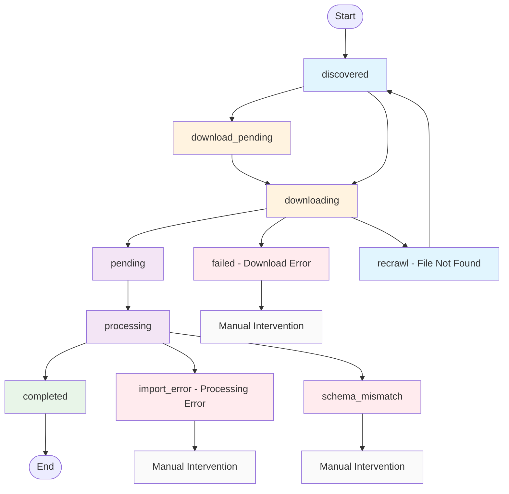

# Parliament Data Pipeline - Import Status Flow Summary

## Overview

The parliament data pipeline uses a centralized `ImportStatus` table to track files through a multi-stage process: Discovery → Download → Processing. This document provides a comprehensive overview of all status values, transitions, and the components responsible for each stage.

## Import Status Values

The `ImportStatus.status` field can have the following values:

| Status | Description | Stage | Next Status |
|--------|-------------|-------|-------------|
| `discovered` | File URL found by discovery service | Discovery | `downloading` |
| `download_pending` | File marked for download (legacy/internal) | Download Queue | `downloading` |
| `downloading` | File currently being downloaded | Download | `pending`, `recrawl`, or `failed` |
| `pending` | File downloaded and ready for processing | Processing Queue | `processing` |
| `processing` | File currently being processed/imported | Processing | `completed` or `import_error` |
| `completed` | File successfully processed and imported | Final | (end state) |
| `failed` | Download failed with error | Final | Manual intervention |
| `recrawl` | File not found, needs URL refresh | Discovery | `discovered` |
| `import_error` | Processing failed with error | Final | Manual intervention |
| `schema_mismatch` | File has schema validation issues | Processing | Manual intervention |

## Pipeline Architecture

```mermaid
graph TD
    A[Discovery Service] --> B[ImportStatus Table]
    B --> C[Download Manager]
    C --> D[Import Processor]
    
    A -->|Creates records with status='discovered'| B
    C -->|Processes files with status in ['discovered', 'download_pending']| B
    D -->|Processes files with status='pending'| B
```

## Status Flow Diagram



## Component Responsibilities

### 1. Discovery Service (`discovery_service.py`)

**Responsibilities:**
- Crawls parliament website sections systematically
- Extracts file URLs, categories, and metadata
- Creates ImportStatus records with `status='discovered'`
- Handles recrawl functionality for URL refresh

**Status Transitions:**
- `null` → `discovered` (new file discovered)
- `recrawl` → `discovered` (URL refreshed, increments recrawl_count)
- `completed` → `download_pending` (file changed, needs re-download)

**Key Methods:**
- `discover_all_files()` - Main discovery orchestration
- `recrawl_files()` - Refresh URLs using source page metadata
- `_store_file_url()` - Create ImportStatus records

### 2. Download Manager (`pipeline_orchestrator.py`)

**Responsibilities:**
- Downloads files from discovered URLs
- Stores files to disk with unique identifiers
- Updates file metadata (hash, size, timestamps)
- Manages download queue and rate limiting

**Status Transitions:**
- `discovered`/`download_pending` → `downloading` (download started)
- `downloading` → `pending` (download successful)
- `downloading` → `failed` (download error)
- `downloading` → `recrawl` (404/not found, needs URL refresh)

**Key Features:**
- HTTP retry with exponential backoff
- File type filtering (defaults to XML only)
- Rate limiting (configurable delay)
- SHA1 hash calculation for file integrity

### 3. Import Processor (`database_driven_importer.py`)

**Responsibilities:**
- Processes downloaded files using schema mappers
- Validates XML structure and content
- Maps XML data to database models
- Updates import statistics and error tracking

**Status Transitions:**
- `pending` → `processing` (import started)
- `processing` → `completed` (import successful)
- `processing` → `import_error` (processing error, increments error_count)
- `processing` → `schema_mismatch` (validation issues)

**Key Features:**
- Change detection using HTTP HEAD requests
- Schema-specific mappers for different file types
- Dependency-aware import ordering
- Error handling with detailed logging

## File Type Filtering

The pipeline supports filtering by file types at multiple levels:

**Supported File Types:**
- `XML` (default, primary data format)
- `JSON` (structured data)
- `PDF` (documents)
- `Archive` (compressed files)
- `XSD` (schema definitions)

**Filter Application:**
- Download Manager: Only downloads allowed file types
- Import Processor: Only processes allowed file types
- Database queries: Filtered at SQL level for performance

## Error Handling and Recovery

### Failed Status Handling

**Download Failures:**
- Network errors, timeouts, HTTP errors → `failed` status
- 404/Not Found errors → `recrawl` status (automatic URL refresh)
- HTTP retry logic with exponential backoff
- Manual restart or recrawl required for failed downloads

**Processing Failures:**
- XML parsing errors, mapper exceptions → `import_error` status
- Error count incremented for tracking repeated failures
- Can be reprocessed by updating status to `pending`

**Schema Mismatch:**
- XML structure doesn't match expected schema
- Status set to `schema_mismatch` with validation details
- Requires manual review and potential mapper updates

### Recovery Mechanisms

1. **Automatic Recrawl System:**
   - 404/Not Found downloads automatically marked as `recrawl`
   - Discovery service finds new URL using source page metadata
   - Recrawl count incremented for tracking attempts
   - Preserves file identity while updating access URL

2. **Error Tracking and Monitoring:**
   - Error count incremented for each processing failure
   - Recrawl count tracks URL refresh attempts
   - Detailed error messages with full context
   - Statistics available for analysis and monitoring

3. **Change Detection:**
   - HTTP HEAD requests check for file modifications
   - Compares Last-Modified, ETag, Content-Length headers
   - Automatically re-downloads changed files

4. **Manual Intervention:**
   - Failed records can be manually reset to earlier statuses
   - Status updates trigger automatic pipeline progression
   - Tracking counters help identify problematic files

## Database Schema

### ImportStatus Table Key Fields

```sql
CREATE TABLE import_status (
    id INTEGER PRIMARY KEY,
    file_url VARCHAR(1000) NOT NULL,
    file_path VARCHAR(500),
    file_name VARCHAR(200) NOT NULL,
    file_type VARCHAR(20) NOT NULL,
    category VARCHAR(100) NOT NULL,
    legislatura VARCHAR(20),
    
    -- HTTP metadata for change detection
    last_modified DATETIME,
    content_length INTEGER,
    etag VARCHAR(200),
    
    -- Discovery metadata for URL refresh
    source_page_url VARCHAR(1000),
    anchor_text VARCHAR(500),
    url_pattern VARCHAR(200),
    
    -- Processing status and metadata
    status VARCHAR(50) NOT NULL DEFAULT 'pending',
    error_message TEXT,
    records_imported INTEGER DEFAULT 0,
    processing_started_at DATETIME,
    processing_completed_at DATETIME,
    
    -- Error tracking and retry counters
    recrawl_count INTEGER DEFAULT 0,
    error_count INTEGER DEFAULT 0,
    
    created_at DATETIME DEFAULT NOW(),
    updated_at DATETIME DEFAULT NOW()
);
```

### Status Indexes for Performance

```sql
-- Query optimization indexes
CREATE INDEX idx_import_status_status ON import_status(status);
CREATE INDEX idx_import_status_category ON import_status(category);
CREATE INDEX idx_import_status_legislatura ON import_status(legislatura);
CREATE INDEX idx_import_status_hash ON import_status(file_hash);
```

## Pipeline Orchestrator UI

The Rich-based terminal UI provides real-time status monitoring:

### Status Display Colors
- 🔵 `discovered` - Blue (newly found)
- 🟡 `download_pending` - Yellow (queued for download)  
- 🟢 `pending` - Green (ready for processing)
- 🔄 `processing` - Animated (currently processing)
- ✅ `completed` - Green checkmark (finished)
- ❌ `failed` - Red X (download error occurred)
- 🟠 `recrawl` - Orange (needs URL refresh)
- 🔴 `import_error` - Red (processing error occurred)

### Statistics Tracking
- Discovery: Files cataloged count
- Downloads: Success/error counts and queue size
- Imports: Success/error counts and total records imported
- Real-time activity log with timestamps

## Command-Line Interfaces

### Pipeline Orchestrator
```bash
# Start full pipeline (XML files only by default)
python pipeline_orchestrator.py

# Process all file types
python pipeline_orchestrator.py --all-file-types

# Filter by legislature and category
python pipeline_orchestrator.py --legislature XVII --category "Atividade Deputados"

# Adjust rate limiting
python pipeline_orchestrator.py --discovery-rate-limit 1.0 --download-rate-limit 0.5
```

### Database-Driven Importer
```bash
# Process pending imports (XML only by default)
python database_driven_importer.py

# Process specific file types
python database_driven_importer.py --file-types XML JSON

# Force reimport completed files
python database_driven_importer.py --force-reimport

# Strict mode (stop on first error)
python database_driven_importer.py --strict-mode
```

### Discovery Service
```bash
# Run discovery for all sections
python discovery_service.py

# Discovery with filters
python discovery_service.py --legislature XVII --category "Registo Biográfico"

# Recrawl files with expired URLs
python discovery_service.py --recrawl --recrawl-status recrawl
```

## Performance and Scaling

### Rate Limiting
- Discovery: 0.5s default delay between page requests
- Downloads: 0.3s default delay between file downloads
- Configurable via command-line arguments

### Parallel Processing
- Discovery, download, and import run concurrently
- Thread-safe queue management between stages
- Real-time progress tracking and statistics

### Resource Management
- HTTP retry with exponential backoff (1s → 2s → 4s → 8s → 120s max)
- Connection pooling and session reuse
- Automatic file cleanup and disk space management

## Quality Gates and Validation

### Import Order Dependencies
Files are processed in dependency order to respect foreign key relationships:

1. `atividade_deputados`
2. `atividades`
3. `composicao_orgaos`
4. `informacao_base`
5. `registo_biografico`
6. And 10 more types in dependency order...

### Data Integrity
- SHA1 hash verification for downloaded files
- XML structure validation before processing
- Schema-specific validation rules
- Comprehensive error logging and reporting

## Monitoring and Observability

### Real-time Metrics
- Processing speed (files per minute)
- Error rates by stage and file type
- Queue sizes and processing backlogs
- Network retry statistics

### Activity Logging
- Timestamped activity log in UI
- Detailed error messages with context
- File-level processing statistics
- Success/failure tracking by category

This comprehensive flow ensures reliable, observable, and recoverable processing of parliament data from discovery through final import into the database.